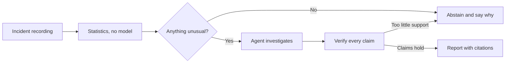
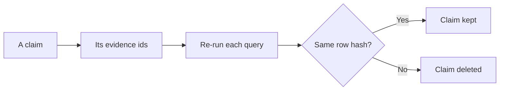
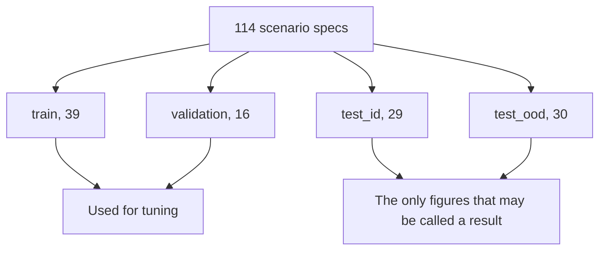

# Firebreak

An AI SRE that investigates an incident, names a cause or says it cannot, and links every
sentence in its report to the query behind it.

[Explainer site](https://hoomanesteki.github.io/firebreak-ai-sre-agent/) ·
[Reference site](https://hoomanesteki.github.io/firebreak-ai-sre-agent/reference/) ·
[Decisions](docs/adr/) · [Runbook](docs/runbook.md)

## What it does

You give it a recording of an incident. It returns one of two things:

- **A named root cause.** Every claim links to the query, time window and rows behind it.
- **An abstention.** Nothing was unusual enough to investigate, and it tells you the number it
  measured and the threshold it compared against.

Before publishing, it re-runs every cited query. If a query now returns something different, the
claim that cited it is deleted.

## Status

All 13 phases are implemented and the offline path is tested end to end. **Held-out performance
is not measured yet**, and the project is built to say so rather than to imply otherwise.

- `make release-check` lists the evaluations still missing and exits unsuccessfully until they
  exist. "Ready to release" is a machine-checkable claim here, not an opinion.
- Every report in `reports/eval/` is marked `quotable_as_a_result: false` with a reason, and both
  sites refuse to publish a figure from any of them.

Two things are missing, and neither is a coding task:

| Missing | Effect |
|---|---|
| Model credentials | No model has run, so there is nothing to measure about model quality |
| Recordings for the held-out splits | The library is 114 specs; only one tuning split is partly recorded |

## The problem it is built for

During an incident, the hard part is not the fix. It is choosing which of forty services to look
at.

1. **The service that alerts you is usually not the one that broke.** Payment fails, checkout
   shows errors, the frontend shows errors. The loudest service is furthest from the cause.
2. **The reasoning disappears.** Whoever worked it out at 3am rarely writes down why.

An agent that answers faster helps with neither, because a confident wrong answer sends people to
the wrong dashboard. So the design targets two different questions: can you **check** the answer,
and will it **stay quiet** when the evidence does not support one.

## How it works



**1. Load a frozen recording.** Parquet files read through DuckDB. The same recording always
gives the same result, so when a number moves you know the code moved.

**2. Run statistics first, with no model.** Score each service for how unusual it looks, then
walk the service call graph to find which service best explains the pattern rather than which
shows it most. This hands the model three services instead of forty.

**3. Stop if nothing is wrong.** No service unusual enough means the investigation ends, naming
the largest deviation found and the threshold it failed. On a healthy system that is the correct
answer.

**4. Investigate within a budget.** A commander picks the next theory. Four specialists gather
evidence from metrics, logs, traces and change history. A critic argues against the leading
theory. Rounds, tool calls, tokens and elapsed time are capped.

**5. Verify, then publish.** Six checks run on the report. The important one re-runs every cited
query and compares a hash of the rows. A failing claim is deleted, not flagged, because a flagged
claim still gets quoted.

## What it does differently

| Choice | What it buys | What it costs |
|---|---|---|
| Statistics before any model | A shortlist, a cost floor, and a baseline every agent must beat | A fault the statistics miss is one the agent never sees |
| Tools build their own queries | A query nobody can inject into, and a row cap on every call | The agent can only ask the 14 questions somebody wrote a tool for |
| The gate deletes claims | Every surviving sentence re-ran to the same bytes | A report can come back thinner than the investigation was |
| Abstention is a real answer | It stays quiet on a healthy system and names the threshold | It also stays quiet on some real faults |

## Results

<!-- stats:start -->
| Metric | Value | Source |
|---|---|---|
| Scenario library | 114 scenario specs; recordings ship as a release asset, not in this repository | scenarios/specs |
| Offline demo | 10 incidents, 56 cassettes recorded from mode stub | recordings/cassettes/manifest.json |
| Root cause accuracy, held-out ID test | not measured: the held-out splits have no recordings | no report |
| Root cause accuracy, held-out OOD test | not measured: the held-out splits have no recordings | no report |
| B0 triage accuracy, held-out ID test | not a result: this report is over synthetic fixtures, not recorded incidents | reports/eval/b0/test_id/2026-09-25_edb92d082888.json |
| Abstention accuracy, held-out ID test | not measured: the held-out splits have no recordings | no report |
| Cost per investigation | not measured: no model has run, so there is no model result to report | no report |
<!-- stats:end -->

Every row is generated by `scripts/build_site_stats.py` from a file under `reports/`, and the
Source column names it. A row reads "not measured" or "not a result" when the report behind it
does not support a claim about performance. None of them does yet.

## Quickstart

No model, no Docker, no network:

```bash
git clone git@github.com:hoomanesteki/firebreak-ai-sre-agent.git
cd firebreak-ai-sre-agent
make setup
make demo
make console   # http://127.0.0.1:8080
```

`make demo` rebuilds 10 incidents from their specs and replays each against 56 saved
answers. Two of them abstain, which is correct for those two. It is part of `make verify`, so it
is checked on every commit.

> [!WARNING]
> The demo replays a deterministic stub, not a model, and prints that before its first line. It
> names every fault in its set; the same statistics step, measured on real recordings, names one
> of seven. It shows the pipeline runs and reproduces. It says nothing about quality.

With a local model, any OpenAI-compatible endpoint including Ollama:

```bash
export LLM_BASE_URL=http://localhost:11434/v1
export LLM_API_KEY=ollama
make demo
```

`make live` starts the pinned OpenTelemetry Demo and needs Docker with about 6 GB of memory.

## How a report is verified



Six checks: `coverage`, `re_execution`, `numbers`, `consistency`, `confidence_sanity`,
`abstention`. See SPEC.md Section 6.9.

> [!NOTE]
> The gate cannot check whether a claim **says** anything. All 40 claims across the ten demo
> reports are true, cited, re-runnable and uninformative, because they come from a stub. Whether
> to add a seventh check is an open question in `docs/phase-reports/P12.md`.

## Evaluation

Incidents are recorded from the OpenTelemetry Demo with faults injected through its feature
flags, which gives a true label for every incident.



`test_id` holds back variants and seeds of known fault types. `test_ood` holds back entire fault
families, to ask whether the system generalised or memorised. Splitting is by specification, not
by recording.

Seven graders, three baselines, six ablations, bootstrap intervals, and a gate that reports
`INCONCLUSIVE` separately from `FAIL`. See SPEC.md Section 9.

**The agent never sees a label.** Labels live in a package only the evaluation code may import,
enforced by a test that walks the import graph. Every label carries a canary that every prompt is
scanned for. The change log the agent reads has fault flag changes removed. See SPEC.md Section
8.4.

## Security and limitations

Logs, traces and alert text are written by software and sometimes by attackers, so Firebreak
treats them as data and never as instruction. Agents hold read-only credentials. The only write
path is a separate approval service that requires a person and then checks the metric recovered.
Traces carry shapes, never prompt content. See [`docs/threat-model.md`](docs/threat-model.md).

**Limits of the benchmark.** Faults injected through feature flags are cleaner than real
incidents: one clear cause, a known onset. The distractor, double-fault and no-fault families and
the out-of-distribution split make it harder, and it is still easier than production.

**Limits of the system.** It abstains on most real faults in the recorded set, and the ranking
blames the frontend for payment failures, which is the symptom over the cause. Both are recorded
with their evidence in the phase reports.

## Not in v1

Kubernetes tooling, paging and chat integrations, autonomous remediation without approval, model
fine-tuning, and multi-tenant deployment. See SPEC.md Section 3.2.

## Documentation

| Document | For |
|---|---|
| [`docs/runbook.md`](docs/runbook.md) | Seven operational procedures, each saying how to tell it worked |
| [`docs/threat-model.md`](docs/threat-model.md) | The OWASP agentic mapping and the limits of each control |
| [`docs/adr/`](docs/adr/) | 14 decision records, each listing what it rejected |
| [`docs/phase-reports/`](docs/phase-reports/) | One per phase, including what each could not do |
| [`docs/demo-shot-list.md`](docs/demo-shot-list.md) | The demo video script |
| `SPEC.md` | The contract. Everything above is downstream of it |

## Development

<!-- engineering:start -->
2257 tests passing, 24 skipped, 85.6% coverage against a floor of 85%.
<!-- engineering:end -->

Type checking runs on three platforms. A hygiene gate refuses em dashes, filler words and AI
attribution, and it also checks that the two generated regions in this file still match the
reports they come from.

```bash
make verify        # lint, types, tests, hygiene, leakage, offline demo
make verify-clean  # the same in a fresh clone, where local state shows up
make release-check # what still blocks a release
make site          # both sites
make ci-status     # what CI said about the last push
```

`make verify-clean` exists because `make verify` runs against a working tree and CI runs against
a fresh clone. Everything git-ignored is the difference.

Commit messages follow Conventional Commits and are checked by a hook. `CLAUDE.md` and
`AGENTS.md` hold the working rules.

## License

MIT. See [`LICENSE`](LICENSE).

The target system is the [OpenTelemetry Demo](https://github.com/open-telemetry/opentelemetry-demo),
Apache-2.0, used unmodified at a pinned release.
