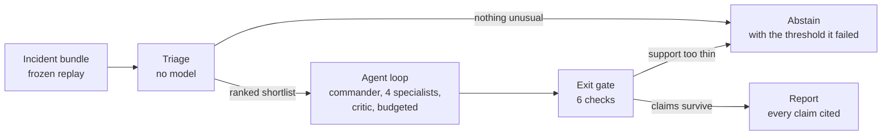
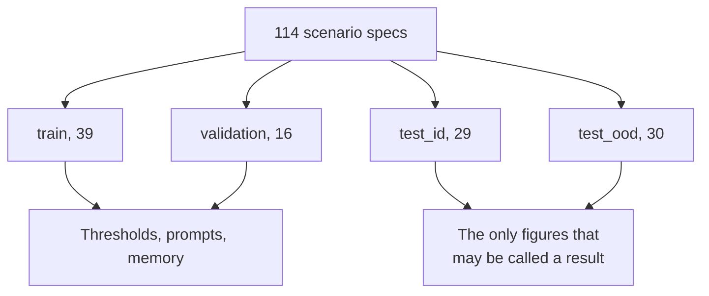

# Firebreak

**A multi-agent AI SRE that investigates production incidents and cites evidence you can
re-run.** It names a root cause or refuses to, links every sentence in its report to the query
behind it, and is benchmarked on fault-injected incidents from the OpenTelemetry Demo.

[Explainer site](https://hoomanesteki.github.io/firebreak-ai-sre-agent/) ·
[Reference site](https://hoomanesteki.github.io/firebreak-ai-sre-agent/reference/) ·
[Decisions](docs/adr/) · [Runbook](docs/runbook.md)

## Status

All 13 phases are complete (SPEC.md Section 17). The system is built, tested end to end, and
**has not been measured**.

Two things are missing, and every page and report says so where a number would go:

- **No model has run.** No credentials are configured, so the deterministic floor publishes
  triage's answer with a label saying no AI analysis happened.
- **Both held-out test splits have no recordings.** The library is 114
  scenario specs and only one tuning split is partly recorded.

Every eval report in `reports/eval/` is marked `quotable_as_a_result: false` with its reason, and
the site build refuses to publish a figure from any of them. That is deliberate: two figures in
this repository look quotable and are not.

## The problem

The expensive part of an incident is not the fix. It is the twenty minutes spent deciding which
of forty services to look at, made from dashboards under time pressure.

Two things go wrong in those minutes, and they pull in opposite directions:

| What goes wrong | Why the obvious fix makes it worse |
|---|---|
| The service that pages you is rarely the service that broke | An agent that answers faster gives you a confident wrong service sooner |
| The reasoning is lost by the time the postmortem is written | An agent that writes prose produces a postmortem nobody can check |

So the question is not how to answer more often. A confident wrong answer costs more than no
answer. The question is how to make an answer **checkable**, and how to get the system to **say
nothing** when the evidence will not support saying something.

## How it works



Triage runs before any model and can end the investigation on its own. On a healthy system the
cheapest correct answer is to stop.

## What it does differently

Four commitments, each with a cost worth naming.

| Commitment | What it buys | What it costs |
|---|---|---|
| **Deterministic triage first**, with robust z-scores and personalised PageRank | A shortlist, a cost floor, and a baseline any agent must beat | A fault the statistics miss is one the agent never sees |
| **Evidence or nothing.** Every tool call records its query, window, backend fingerprint and row hash | Claims that can be re-executed to the same bytes | The agent can only ask the 14 questions somebody wrote a tool for |
| **A gate that removes claims**, not one that annotates them | A report where every remaining sentence survived re-execution | A report can come back thinner than the investigation was |
| **Abstention as a real answer** | It says nothing on a healthy system, and names the threshold it failed | It abstains on real faults too, which is the largest open problem |

## Results

<!-- stats:start -->
| Metric | Value | Source |
|---|---|---|
| Scenario library | 114 scenario specs; recordings ship as a release asset, not in this repository | scenarios/specs |
| Offline demo | 10 incidents, 56 cassettes recorded from mode stub | recordings/cassettes/manifest.json |
| Root cause accuracy, held-out ID test | not measured: the held-out splits have no recordings | no report |
| Root cause accuracy, held-out OOD test | not measured: the held-out splits have no recordings | no report |
| B0 triage accuracy, held-out ID test | not a result: this report is over synthetic fixtures, not recorded incidents | reports/eval/b0/test_id/2026-09-25_edb92d082888.json |
| Abstention accuracy, held-out ID test | not measured: the held-out splits have no recordings | no report |
| Cost per investigation | not measured: no model has run, so there is no model result to report | no report |
<!-- stats:end -->

Every row is generated by `scripts/build_site_stats.py` from a file under `reports/`, and the
Source column names it. A row reads "not measured" or "not a result" when the report behind it
does not support a claim about performance. None of them does yet.

## Quickstart

No model, no Docker, no network:

```bash
git clone git@github.com:hoomanesteki/firebreak-ai-sre-agent.git
cd firebreak-ai-sre-agent
make setup
make demo      # chooses live or offline, and says which
make console   # six pages on http://127.0.0.1:8080
```

`make demo` rebuilds 10 incidents from their scenario specs,
replays them against 56 recorded answers, and fails if any stops
reproducing. It is part of `make verify`, so it is checked on every commit rather than being a
demo that rots. Two of the ten abstain, which is the right answer for them.

> [!WARNING]
> The demo replays a deterministic stub rather than a model, and prints that before its first
> line. It names every fault in the set; the same triage, measured on real recordings, names
> one of seven. It shows the whole path runs and reproduces. It says nothing about quality.

With a local model, any OpenAI-compatible endpoint including Ollama:

```bash
export LLM_BASE_URL=http://localhost:11434/v1
export LLM_API_KEY=ollama
make demo
```

`make demo` also runs against the live stack when one is up; it reports which it chose and what
would have changed the choice. `make live` starts the pinned OpenTelemetry Demo and needs Docker
with about 6 GB of memory.

## How a report is verified

```mermaid
flowchart LR
  C["Claim"] --> E["Evidence ids it cites"]
  E --> RR["Re-execute each query"]
  RR --> HSame row hash?
  H -->|"yes"| K["Claim kept"]
  H -->|"no"| X["Claim removed"]
```

Six checks run on the finished report: `coverage`, `re_execution`, `numbers`, `consistency`,
`confidence_sanity`, `abstention`. A claim that fails is removed rather than annotated, because a
warning beside a claim is a claim that still gets quoted. See SPEC.md Section 6.9.

> [!NOTE]
> The gate cannot check whether a claim **says** anything. All 40 claims across the ten showcase
> reports are true, cited, re-runnable and uninformative, because they come from a deterministic
> stub. Whether to add a seventh check is an open question in `docs/phase-reports/P12.md`.

## Evaluation

Incidents are recorded from the OpenTelemetry Demo with faults injected through its feature
flags, which gives a true label for every incident.



Splits are held out by scenario spec, and `test_ood` holds back entire fault families to ask
whether the system generalised or memorised. Seven graders, three baselines, six ablations,
bootstrap intervals, and a non-inferiority gate that reports `INCONCLUSIVE` separately from
`FAIL`. See SPEC.md Section 9.

**The agent never sees a label.** Labels live in a package only the eval code may import,
enforced by a test that walks the import graph; every label carries a canary that every prompt is
scanned for; and the change log the agent reads excludes fault flag flips. See SPEC.md Section
8.4.

## Security and limitations

Logs, traces and alert text are written by software and sometimes by attackers, so Firebreak
treats them as untrusted input and never as instruction. Agents hold read-only credentials, and
the only write path is a separate approval service that requires a person and verifies afterwards
that the metric recovered. Traces carry shapes and never prompt content. See
[`docs/threat-model.md`](docs/threat-model.md).

**Known limits of the benchmark.** Faults injected through feature flags are cleaner than real
incidents: one clear cause, a known onset. The distractor, double-fault and no-fault families
exist to make it harder and the out-of-distribution split checks generalisation, but this is
still easier than production.

**Known limits of the system.** It abstains on most real faults in the recorded set, and the
ranking blames the frontend for payment failures, which is the symptom over the cause. Both are
recorded with their evidence in the phase reports.

## Not in v1

Kubernetes tooling, paging and chat integrations, autonomous remediation without approval, model
fine-tuning, and multi-tenant deployment. See SPEC.md Section 3.2.

## Documentation

| Document | What it is for |
|---|---|
| [`docs/runbook.md`](docs/runbook.md) | Seven operational procedures, each saying how to tell it worked |
| [`docs/threat-model.md`](docs/threat-model.md) | The OWASP agentic mapping and the limits of each control |
| [`docs/adr/`](docs/adr/) | 14 decision records, each with the alternatives it rejected |
| [`docs/phase-reports/`](docs/phase-reports/) | One report per phase, including what each could not do and why |
| [`docs/demo-shot-list.md`](docs/demo-shot-list.md) | The demo video script, with two scenes marked unrecordable |
| [`docs/release-notes-v1.0.0.md`](docs/release-notes-v1.0.0.md) | Release notes for `v1.0.0`. Read the "before the feature list" section first |
| `SPEC.md` | The contract. Everything above is downstream of it |

## Development

2069 tests, 85.38% coverage against an exact 85%
floor, three-platform type checking, and a hygiene gate that refuses em dashes, filler words and
AI attribution.

```bash
make verify        # lint, types on three platforms, tests, hygiene, leakage, offline demo
make verify-clean  # the same in a fresh clone, where git-ignored local state shows up
make site          # the explainer and reference sites
make ci-status     # what CI said about the last push
```

`make verify-clean` exists because `make verify` runs against a working tree and CI runs against
a fresh clone. Everything git-ignored is the difference, and a test that reads one of those files
passes locally and fails in CI.

Commit messages follow Conventional Commits and are checked by a hook. `CLAUDE.md` and
`AGENTS.md` hold the working rules.

## License

MIT. See [`LICENSE`](LICENSE).

The target system is the [OpenTelemetry Demo](https://github.com/open-telemetry/opentelemetry-demo),
Apache-2.0, used unmodified at a pinned release.
